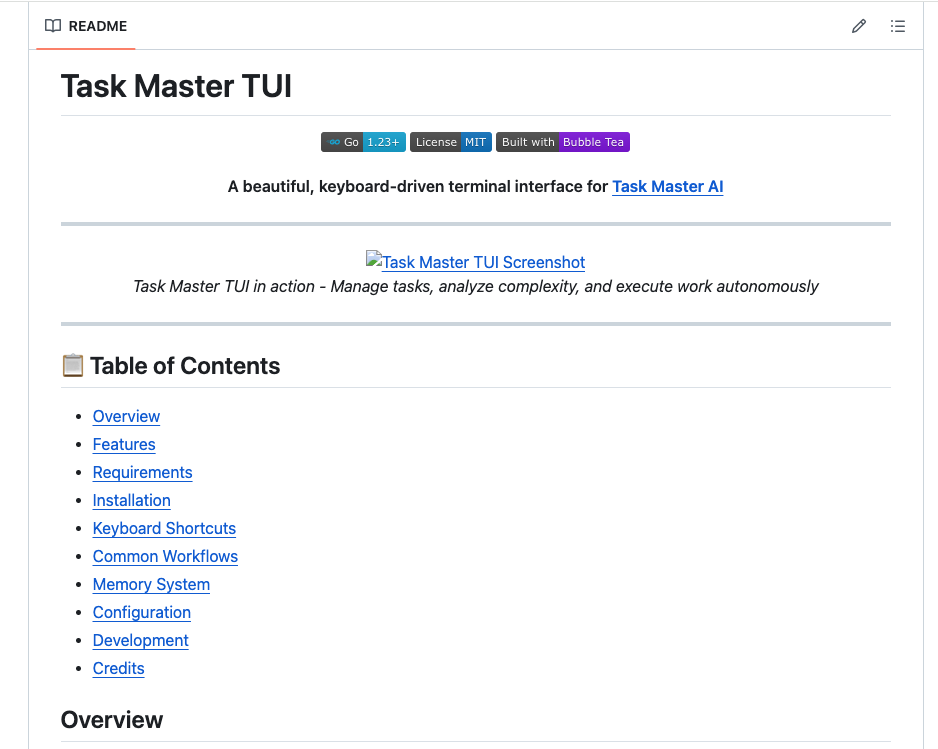

# Task Master TUI

<div align="center">

[](https://go.dev/)
[](LICENSE)
[](https://github.com/charmbracelet/bubbletea)

**Keyboard-driven terminal interface for [Task Master AI](https://github.com/cyanheads/task-master-ai)**

</div>

---

<div align="center">
  
</div>

---

## 📋 Table of Contents

- [Overview](#overview)
- [Features](#features)
- [Requirements](#requirements)
- [Installation](#installation)
- [Keyboard Shortcuts](#keyboard-shortcuts)
- [Common Workflows](#common-workflows)
- [Memory System](#memory-system)
- [Configuration](#configuration)
- [Development](#development)
- [Credits](#credits)

## Overview

Terminal interface for managing development tasks, viewing task hierarchies, and executing Task Master commands. Integrates with Task Master AI for project management with autonomous task execution and detailed completion logging.

## Features

- 🎯 **Task Management**: View and navigate task hierarchies
- ✏️ **In-Place Task Updates**: Add notes and implementation details to tasks
- 🔄 **Real-time Sync**: Auto-updates when task files change via fsnotify
- ⌨️ **Keyboard-driven**: Full navigation and control via keyboard shortcuts
- 🎨 **Terminal UI**: Built with Bubble Tea and Lipgloss
- 🔍 **Search & Filter**: Find tasks by ID, title, status, or content
- 📊 **Complexity Analysis**: AI-powered task complexity scoring
- 🚀 **Task Expansion**: AI-generated subtasks for complex work
- 🏷️ **Task Tagging**: Organize and filter with custom tags
- 📦 **Project Management**: Multiple project-specific task views
- 🗑️ **Safe Deletion**: Confirmation dialogs prevent accidents
- 📄 **PRD Creation & Parsing**: AI-assisted PRD generation and task loading
- 🔴 **Live Output Streaming**: Real-time feedback for operations
- 🤖 **Autonomous Task Execution**: AI-powered task completion with decision-making
- 📋 **Completion Logging**: Detailed logs of execution, challenges, and solutions
- 💡 **Context-sensitive Help**: Dynamic help panels and status hints
- ⚙️ **Customizable**: JSON-based configuration
- 🎯 **Accessibility**: High-contrast themes, text labels, keyboard-only navigation

## Requirements

- Go 1.23 or later
- [Task Master AI](https://github.com/cyanheads/task-master-ai) installed globally (`npm i -g task-master-ai`)
- A Task Master project (`.taskmaster` directory with tasks)

## Installation

### Quick Install (Recommended)

```bash
# Install tm-tui directly
go install github.com/agreen757/tm-tui/cmd/tm-tui@latest

# Run directly using full path
~/go/bin/tm-tui
```

### Making the Command Available System-Wide

After installation, ensure `~/go/bin` is in your PATH to use `tm-tui` directly:

```bash
# For Zsh (macOS default)
echo 'export PATH="$HOME/go/bin:$PATH"' >> ~/.zshrc
source ~/.zshrc

# For Bash
echo 'export PATH="$HOME/go/bin:$PATH"' >> ~/.bash_profile
source ~/.bash_profile
```

After adding to your PATH, you can simply use:

```bash
tm-tui
```

### Building from Source (Alternative)

```bash
# Clone the repository
git clone https://github.com/agreen757/tm-tui.git
cd tm-tui

# Build
make build

# Run the built binary
./bin/tm-tui
```

### Keyboard Shortcuts

#### Navigation

- `↑/k` - Move up
- `↓/j` - Move down
- `←/h` - Navigate left / collapse
- `→/l` - Navigate right / expand
- `Tab` - Switch between panels
- `PageUp/PageDn` - Scroll by page
- `Esc` - Back / close dialog

#### Task Management

- `n` - Jump to next available task
- `s` - Change task status
- `Enter` - Select item / toggle expand
- `Space` - Multi-select task for bulk operations
- `Ctrl+R` / `Alt+R` - Run task with Crush AI agent
- `Ctrl+U` - Update selected task (add notes, progress, or implementation details)
- `Alt+X` - Expand tasks (opens scope selection dialog)
  - Supports single task, all tasks, task range, or by tag
  - AI-powered expansion with --research flag
  - Configurable depth (1-3 levels) and subtask count
- `Alt+D` - Delete selected task (with confirmation)
- `d` - Mark task as done (quick status change)
- `p` - Change task priority

#### PRD & Document Management

- `Alt+Shift+P` - Create new PRD (interactive form)
- `Alt+P` - Parse PRD file (load tasks from document)

#### Git Operations

- `g` - Open Git menu
  - View repository status
  - Switch branches
  - Create new branches
  - View commit history

#### Complexity & Analysis

- `Ctrl+Shift+C` - Analyze task complexity (AI-powered scoring)

#### Tag Management

- `Ctrl+T` - Manage tag contexts (switch active tag, visual selector)
- `Ctrl+Shift+T` - Add new tag context (create tag with options)
- `Ctrl+Shift+A` - Quick tag access (selector with add option)
- `Alt+Shift+T` - View project tags (filter by project context)

#### Project Management

- `Ctrl+P` - Command palette (general project access)
- `Alt+Shift+Q` - Quick project switch (find projects quickly)
- `Alt+Shift+S` - Project search (full-text project search)

#### Filtering & Search

- `/` - Search tasks by ID, title, or content
- `f` - Filter tasks by status or tag
- `F` - Clear all filters

#### View & Display

- `1` - Switch to tree view
- `2` - Switch to list view
- `Alt+T` - Cycle through view modes
- `Alt+L` - Toggle log panel
- `Alt+I` - Toggle details panel
- `Ctrl+F` - Open log file browser dialog

#### Global Commands

- `?` - Show/hide help overlay
- `:` - Open command palette for additional commands
- `r` - Refresh tasks from disk
- `Ctrl+Z` - Undo (task modifications)
- `Ctrl+Shift+C` - Clear TUI state
- `q` - Quit TUI

## Version History

For detailed information about all releases, new features, bug fixes, and improvements, see the [CHANGELOG.md](CHANGELOG.md).

### Latest Release: v0.1.24

**Task Score Highlighting** - Enhanced visual representation of task complexity with consistent color-coding and improved accessibility.

- Color-coded complexity indicators (Low: Blue, Medium: Turquoise, High: Orange, Very High: Crimson)
- Accessible text labels for all complexity levels
- Consistent styling across all complexity representations
- Combined visual and textual indicators for better readability
- Enhanced test coverage with 200+ new test lines
- Improved color contrast for better visibility
- Support for both numeric complexity scores and level enums

### Previous Release: v0.1.23

**Log Browser & Performance Optimization** - Browse and search log files directly within the TUI, plus enhanced caching for improved performance.

- Press `Ctrl+F` to open the Log Browser dialog
- Navigate and view all log files in `.taskmaster/logs/`
- Full-featured log viewer with line numbers, word wrap, and search
- Thread-safe LRU cache implementation for improved performance
- 10,000+ new test lines for comprehensive test coverage
- Supports markdown formatting and syntax highlighting

See [CHANGELOG.md](CHANGELOG.md) for complete version history and detailed release notes.

## Memory System

Task Master TUI includes a persistent memory system powered by **BadgerDB** for AI agents and LLMs. This enables cross-session learning, context preservation, and implementation artifact storage with high-performance key-value operations.

The memory system is a **core feature** that works seamlessly with your Task Master workflow, allowing agents to learn from previous implementations and maintain context across sessions.

### Quick Start

```bash
# Build the project (includes memory binary)
make build

# Store information
./bin/memory store -key "readme:main" -file README.md
./bin/memory store -key "log:2.1" -value "Completed auth implementation"

# Retrieve information
./bin/memory get -key "log:2.1"

# List all stored keys
./bin/memory list
./bin/memory list -prefix "log:"  # Filter by prefix

# Log task progress
./bin/memory log -task "2.1" -message "Started implementing JWT validation"
```

Memory data is stored in `.taskmaster/memory/` using BadgerDB for reliable persistence across sessions.

### How It Works

The memory system stores key-value pairs persistently with BadgerDB:

- **Keys**: Organized by prefix (task:, readme:, log:, context:)
- **Values**: Text or structured JSON data
- **Storage**: BadgerDB embedded key-value store at `.taskmaster/memory/`
- **Access**: Command-line tool or Go API
- **Performance**: O(1) lookups, ACID transactions, optimized for fast queries

### Memory Key Conventions

| Prefix     | Purpose                  | Example                             |
| ---------- | ------------------------ | ----------------------------------- |
| `task:`    | Task metadata and status | `task:2.1` → task info              |
| `log:`     | Task completion logs     | `log:2.1` → implementation details  |
| `readme:`  | Cached documentation     | `readme:main` → README content      |
| `context:` | LLM context snapshots    | `context:session-1` → session notes |

### Storage & Performance

**Default**: BadgerDB storage at `.taskmaster/memory/`

- **Fast**: O(1) key lookups
- **Reliable**: ACID transactions for data consistency
- **Embedded**: No external server required
- **Scalable**: Optimized for development and production
- **Typical disk usage**: <100MB for thousands of entries
- **Concurrent safe**: Handles multiple CLI invocations

**Implementation details**:

- Database path: `.taskmaster/memory/` (auto-created)
- Concurrent safe (handles multiple CLI invocations)
- Automatic garbage collection for obsolete values
- Supports key scanning with prefixes (efficient filtering)
- Data persists across Task Master TUI restarts

### Command Reference

Full command documentation available via:

```bash
./bin/memory help
```

Key commands:

**Store data**

```bash
./bin/memory store -key <key> -file <file>
./bin/memory store -key <key> -value <value> [-json]
```

**Retrieve data**

```bash
./bin/memory get -key <key>
```

**Delete data**

```bash
./bin/memory delete -key <key>
```

**List keys**

```bash
./bin/memory list [-prefix <prefix>] [-json]
```

**Log task activity**

```bash
./bin/memory log -task <id> -message "<activity>"
```

**List stored READMEs**

```bash
./bin/memory readmes
```

## Agent Workflow Integration

The memory system is designed to seamlessly integrate with AI agent workflows. Agents can use the memory system to maintain context, log progress, and store implementation artifacts across sessions.

### Integration with Task Master CLI

Agents working with Task Master can leverage memory for:

- **Context Preservation**: Store session context and previous implementation details
- **Task Logging**: Use `./bin/memory log` to track task completion and progress
- **Implementation Artifacts**: Store code snippets, design decisions, and test results
- **Cross-Session Learning**: Retrieve previous implementations to inform new work

### Typical Agent Workflow

1. **Initialize**: Agent creates a Task Master helper with `DefaultHelper()`
2. **Load Context**: Retrieve previous implementation notes from memory
3. **Implement**: Work on the task, storing progress in memory
4. **Persist**: Log completion details with `memory log` command
5. **Next Task**: Retrieve context for the next task from memory

### Example Integration

```bash
# Load previous implementation context
./bin/memory get -key "log:task-2.1"

# Store implementation notes during work
./bin/memory store -key "log:current-task" -value "Completed JWT validation middleware"

# Log task completion
./bin/memory log -task "3.1" -message "Implemented role-based access control"
```

This integration enables continuous learning and improved decision-making across development sessions.

## Common Workflows

### Creating a PRD with AI

1. Press `Alt+Shift+P` to open the "Create PRD" dialog
2. Fill in the PRD details:
   - **Title**: Short descriptive title for your project
   - **Summary**: Brief overview of what you're building
   - **Scope**: Detailed requirements, constraints, and technical details
   - **Output Filename**: Where to save the generated PRD
3. Select an AI model from the model selection dialog
4. **Watch real-time generation**: Task Runner modal appears showing live Crush output
5. Monitor as the AI generates your PRD with streaming feedback
6. Review and save when complete - file save dialog appears automatically
7. Use `Alt+P` to parse the generated PRD into tasks

**New in v0.1.16:** The Task Runner modal now displays live streaming output during PRD generation, providing immediate visual feedback and progress updates.

### Creating Tasks from a PRD

1. Press `Alt+P` to open the "Parse PRD" dialog
2. Select or enter the path to your PRD document
3. Review the generated tasks in the main view
4. Edit, organize, or prioritize as needed

### Analyzing Task Complexity

1. Navigate to a task or select multiple tasks with `Space`
2. Press `Ctrl+Shift+C` to open "Analyze Complexity" dialog
3. Choose analysis scope: all tasks, selected task, or by tag
   - Use visual tag selector to pick specific tags for analysis
4. View complexity scores (LOW, MEDIUM, HIGH, VERY HIGH)
5. Filter and sort results for focused planning

### Expanding Tasks into Subtasks

1. Select a task or prepare to expand all tasks
2. Press `Alt+X` to open the "Expand Tasks" dialog
3. Choose expansion scope:
   - **Selected task only** - Expand just the current task
   - **All tasks** - Expand all tasks in the project
   - **Task range** - Expand tasks from ID X to ID Y
   - **By tag** - Use visual tag selector to pick multiple tags for expansion
4. Configure options:
   - Expansion depth: 1-3 levels of nested subtasks
   - Number of subtasks: Leave blank for auto-detection
   - AI assistance: Enable `--research` for intelligent expansion
5. Monitor progress in real-time as CLI executes
6. Review newly created subtasks in the task tree
7. Tasks are automatically reloaded after expansion completes

**Note:** This feature executes `task-master expand` CLI commands. Ensure the Task Master CLI is properly installed and accessible.

### Managing Tags with Visual Selection

The new tag management system provides visual, interactive tag selection:

1. Press `Ctrl+T` to open Tag Management

   - Visual list shows all available tags with metadata
   - Active tag marked with indicator (●)
   - Each tag shows task count and completion status

2. **Switch to a tag**: Select it from the list

   - Immediate context switch
   - All subsequent operations use new tag context

3. **Create a new tag**: Select "Add New Tag..." option

   - Opens inline creation dialog
   - Configure name, copy-from options, description
   - New tag immediately available in list
   - Select it to switch to new context

4. **Quick tag access**: Press `Ctrl+Shift+A` for fast switching
   - Opens tag selector with minimal overhead
   - Add new tags on-the-fly
   - Close when done (Esc)

### Running Tasks with Crush AI

Task Master TUI integrates with [Crush](https://github.com/charmbracelet/crush), an AI-powered terminal assistant, to execute tasks **autonomously with minimal human intervention**. The tool handles complex implementation tasks, test execution, and debugging with detailed logging of all activities and outcomes.

#### Autonomous Execution Capabilities

Crush AI autonomously:

- **Analyzes task requirements** from the task description and implementation details
- **Explores the codebase** to understand project structure and patterns
- **Implements features** following existing code conventions and best practices
- **Writes and runs tests** to validate implementation
- **Debugs issues** by analyzing error messages and adjusting approach
- **Documents changes** through detailed implementation logs
- **Handles edge cases** and error scenarios systematically

#### Prerequisites

- Crush CLI installed and accessible in PATH (`crush` command available)
- API keys configured in Crush for your preferred AI provider

#### Running a Task

1. Navigate to the task you want to execute
2. Press `Ctrl+R` (or `Alt+R`) to start the task runner
3. Model selection inside the task runner is not currently enabled
4. To choose a model, open the Crush CLI (`crush`), press `Ctrl+L` to select a model, exit Crush, then restart the TUI
5. The Task Runner modal opens and shows real-time output from Crush
6. Monitor progress as Crush works through the task

#### Task Runner Modal Controls

- `Tab` / `Shift+Tab` - Switch between task tabs (when running multiple tasks)
- `1-9` - Jump directly to tab number
- `↑/↓` - Scroll output
- `PgUp/PgDn` - Page scroll
- `Home/End` - Scroll to top/bottom
- `Ctrl+W` - Minimize/maximize modal
- `Ctrl+C` - Cancel running task (with confirmation for long-running tasks)
- `Esc` - Close modal (only when no tasks are running)

#### Features

- **Real-time streaming**: See Crush's output as it works
- **Multi-task support**: Run up to 9 tasks concurrently in separate tabs
- **Automatic logging**: All output saved to `.taskmaster/logs/crush-run-<task-id>-<timestamp>.log`
- **Cancellation**: Stop tasks that are stuck or producing incorrect results
- **Minimizable**: Continue using the TUI while tasks run in the background

#### Detailed Completion Logging

When a task executes autonomously, all activities are logged to `.taskmaster/logs/` with comprehensive details:

**Log File Structure** (`.taskmaster/logs/crush-run-<task-id>-<timestamp>.log`):

- **Command Execution**: Full output from all commands run
- **Code Changes**: File modifications with before/after snippets
- **Test Results**: Complete test output and pass/fail status
- **Error Handling**: Error messages encountered and resolution strategies
- **Decision Points**: AI reasoning for implementation choices
- **Debugging Steps**: Investigation and troubleshooting process
- **Performance Notes**: Execution time and resource usage

**Task Completion Summary**:

1. Navigate to a completed task
2. Press `Ctrl+R` to view the task log in the Task Runner modal
3. Scroll through the output to see the complete execution history
4. Use `↑/↓` arrows to review specific sections
5. Task status automatically updates to "done" upon successful completion

**Manual Completion Logging**:
You can add detailed notes after task execution using the Task Master CLI:

```bash
# Log implementation details for a completed task
task-master update-subtask --id=<task-id> --prompt="Implementation completed:
- [List of features implemented]
- [Files modified and changes made]
- [Challenges encountered and solutions applied]
- [Test results and coverage achieved]
- [Integration with other system components]"
```

**Log Retention and Analysis**:

- All execution logs stored in `.taskmaster/logs/` for future reference
- Logs retained until manually deleted (automatic rotation available)
- Use logs to understand task execution patterns and identify bottlenecks
- Review logs during code review or documentation phases
- Reference logs when implementing related tasks for consistency

#### Task Prompt Generation

When you run a task, the TUI generates a prompt for Crush that includes:

- Task ID and title
- Full task description
- Implementation details
- Test strategy
- Priority level
- Dependencies (if any)

You can customize the prompt template by creating a `CRUSH_RUN_INSTRUCTIONS.md` file in your project root. The template supports Go text/template syntax with the following variables:

- `{{.TaskID}}` - Task identifier
- `{{.Title}}` - Task title
- `{{.Description}}` - Task description
- `{{.Details}}` - Implementation details
- `{{.TestStrategy}}` - Testing approach
- `{{.Priority}}` - Task priority
- `{{.Dependencies}}` - Comma-separated dependency IDs

### Managing Task Tags

1. Press `Alt+A` to add tags to the selected task
2. Create new tags or select from existing tags
3. Use `Ctrl+Shift+M` to open the tag context manager
4. Manage tag groups, rename, or organize tags
5. Filter tasks by tag using `f` and selecting tags

### Switching Projects

1. Press `Ctrl+T` to open the project switcher
2. Navigate to your desired project
3. View tasks specific to that project context
4. Use project tags to organize cross-project work

### Git Operations with Task Runner

Git operations in Task Master TUI are executed via the Task Runner, providing real-time streaming output and proper command lifecycle management.

#### Starting a Git Operation

1. Press `g` to open the Git Menu
2. Choose your operation:
   - **Status**: View repository status (files changed, untracked files, etc.)
   - **Switch Branch**: Switch to a different branch
   - **Create Branch**: Create a new branch
   - **Recent Commits**: View recent commit history
3. For branch operations, select from the list and press `Enter`
4. The **Task Runner modal** opens automatically showing:
   - Command being executed
   - Real-time streaming output from git
   - Status indicator (Running/Completed/Failed)

#### Understanding the Task Runner Output

When a git operation executes, you'll see:

- **Header**: Shows the git command being executed (e.g., "git checkout main")
- **Output**: Real-time streaming output from git, line by line
- **Status**: Updates at the bottom showing completion status
- **Logs**: All output is automatically saved to `.taskmaster/logs/git-command-<operation>-<timestamp>.log`

#### Task Runner Controls During Git Operations

- `↑/↓` - Scroll through output
- `Home/End` - Jump to top/bottom of output
- `PgUp/PgDn` - Page scroll through output
- `Ctrl+W` - Minimize/maximize the modal (continue using TUI in background)
- `Esc` - Close modal (when operation is complete)

#### Handling Git Operation Results

**Successful Operation:**

- Output shows git's normal success message
- Status bar displays "Completed ✓"
- You can press `Esc` to close the modal
- Changes are immediately reflected (branches refresh, status updates, etc.)

**Failed Operation:**

- Output shows git's error message
- Status bar displays "Failed ✗"
- Error details are logged for review
- You can close the modal and try again

#### Example Workflows

**Switching Branches**

```
1. Press g → Switch Branch
2. Highlight "feature/my-feature" in the list
3. Press Enter
4. Task Runner shows: git checkout feature/my-feature
5. Output streams in real-time
6. Branch switches, status updates
7. Press Esc to close
```

**Creating a Branch**

```
1. Press g → Create Branch
2. Enter branch name when prompted
3. Task Runner shows: git checkout -b new-feature
4. Output streams in real-time
5. New branch created and checked out
6. Press Esc to close
```

## Development

### Building

```bash
make build
```

### Running

```bash
make run
```

### Testing

```bash
make test
```

### Linting

```bash
make lint
```

## Project Structure

```
tm-tui/
├── cmd/
│   └── tm-tui/                  # Main executable entry point
├── configs/                     # Configuration files
│   └── default.json             # Default configuration
├── internal/                    # Internal packages
│   ├── cli/                     # CLI command definitions
│   ├── config/                  # Configuration loading and validation
│   ├── executor/                # Command execution service
│   ├── taskmaster/              # Task Master integration service
│   └── ui/                      # UI components and models
├── .taskmaster/                 # Task Master files (when used)
│   ├── tasks/                   # Task files directory
│   ├── docs/                    # Documentation
│   ├── reports/                 # Analysis reports
│   └── config.json              # Task Master config
├── go.mod                       # Go module definition
├── go.sum                       # Go dependency checksums
└── Makefile                     # Build and development targets
```

## Core Components

### Task Master Service

The Task Master service (`internal/taskmaster`) provides the following functionality:

- Detection of the nearest `.taskmaster` directory from the current working directory
- Loading and parsing of `tasks.json` files into an in-memory task tree
- Validation of tasks, including dependency checks and status validation
- Real-time file watching to detect changes to task files
- Fast indexing of tasks for O(1) lookups by ID

### UI Components

The UI layer (`internal/ui`) implements a rich terminal interface with:

- Multiple views (task list, task details, help panel)
- Keyboard navigation and shortcuts
- Status bar with contextual hints
- Search and filtering capabilities
- Styled rendering using Lipgloss
- Panel-based layout with dynamic resizing

### Executor Service

The executor service (`internal/executor`) handles:

- Running Task Master CLI commands
- Executing task-related operations
- Managing subprocesses
- Capturing command output for display

## Dependencies

The project relies on the following key Go modules:

### Primary Dependencies

- **github.com/charmbracelet/bubbletea** (v1.3.10): TUI framework for building interactive terminal applications
- **github.com/charmbracelet/bubbles** (v0.21.0): Common components for Bubble Tea applications (lists, viewports, text inputs)
- **github.com/charmbracelet/lipgloss** (v1.1.0): Style definitions for terminal UI applications
- **github.com/fsnotify/fsnotify** (v1.9.0): File system notifications for auto-refreshing when task files change
- **github.com/spf13/cobra** (v1.10.2): Command-line interface framework

### Notable Indirect Dependencies

- github.com/atotto/clipboard: Clipboard operations
- github.com/charmbracelet/x/ansi, cellbuf, term: Terminal utilities
- github.com/muesli/termenv: Terminal environment utilities
- github.com/rivo/uniseg: Unicode text segmentation

## Configuration

Configuration is loaded from `configs/default.json`. You can customize:

- Key bindings
- Theme colors
- UI behavior
- Refresh intervals

Example configuration:

```json
{
  "colors": {
    "accent": "#6D98BA",
    "background": "#1F2335",
    "foreground": "#C0CAF5",
    "success": "#9ECE6A",
    "warning": "#E0AF68",
    "error": "#F7768E"
  },
  "keymap": {
    "quit": "q",
    "help": "?",
    "search": "/"
  },
  "display": {
    "show_status_bar": true,
    "compact_mode": false,
    "theme": "dark"
  }
}
```

## Crush Configuration

Task Master TUI integrates with [Crush](https://github.com/charmbracelet/crush) for AI-powered task execution. The application automatically manages a `.crush.json` configuration file for you.

### Automatic Initialization

When you run tm-tui for the first time in a project, it automatically creates a `.crush.json` file with sensible defaults:

- **Location**: Project root (detected via `.taskmaster`, `.git`, or `go.mod` markers)
- **Default Content**: Schema reference, empty model field, skills paths
- **Non-destructive**: Existing `.crush.json` files are never modified or overwritten
- **Idempotent**: Multiple application starts won't modify your config

The initialization happens during application startup and logs warnings (not errors) if it encounters issues.

### Makefile Targets

The project includes Makefile targets for managing Crush configuration:

```bash
# Check if .crush.json exists (useful for CI/scripts)
make check-project-setup

# Create .crush.json if missing (part of installation)
make init-crush-config

# Full installation (includes init-crush-config)
make install
```

### Manual Configuration

You can manually edit `.crush.json` to configure:

- **model**: Your preferred AI model (e.g., `"gpt-4"`, `"claude-3-sonnet"`)
- **context_paths**: Additional files to include in Crush context
- **skills_paths**: Custom Crush skills directories

Example `.crush.json`:

```json
{
  "$schema": "https://charm.land/crush.json",
  "model": "claude-3-5-sonnet-20241022",
  "options": {
    "context_paths": [],
    "skills_paths": ["./.crush/skills"]
  },
  "version": "1.0"
}
```

### Environment Variables

Override default behavior with environment variables:

- `CRUSH_CONFIG_PATH`: Explicit path to .crush.json
- `CRUSH_PROJECT_ROOT`: Override project root detection

These are useful for multi-project setups or non-standard directory structures.

## Requirements

- Go 1.23+
- Task Master AI installed and accessible in PATH
- A `.taskmaster` directory in your working directory or parent directories

## Contributing

Contributions are welcome! Please feel free to submit issues or pull requests.

1. Fork the repository
2. Create your feature branch (`git checkout -b feature/amazing-feature`)
3. Commit your changes (`git commit -m 'Add some amazing feature'`)
4. Push to the branch (`git push origin feature/amazing-feature`)
5. Open a Pull Request

## License

MIT

## Credits

- Built with [Bubble Tea](https://github.com/charmbracelet/bubbletea)
- Forked from [Crush](https://github.com/charmbracelet/crush)
- Integrates with [Task Master AI](https://github.com/cyanheads/task-master-ai)
- Uses [fsnotify](https://github.com/fsnotify/fsnotify) for file system monitoring
- UI components from [Charm](https://charm.sh/)'s libraries
